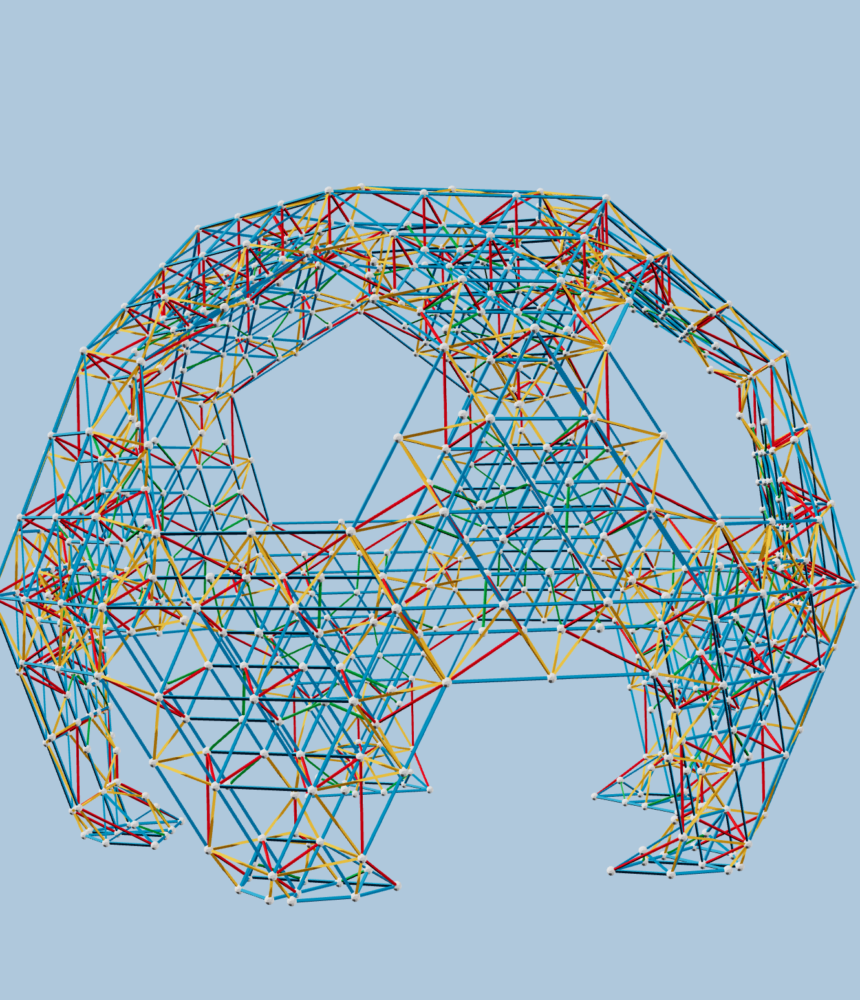
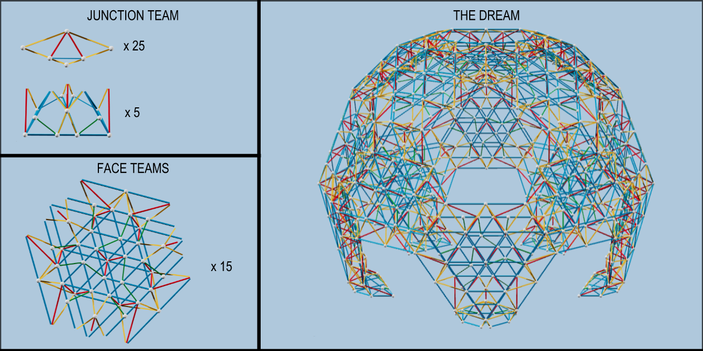


中文版本基于 Scott Vorthmann 的 SUMaC 2026 Zome Build 页面：
https://vorth.github.io/vzome-sharing/2026/07/02/SUMaC-2026-Zometool-Build-13-52-17-489Z.html


  今天我们要搭建一个大型 Zometool 模型：一个截半二十面体形状的穹顶。模型直径接近两米。

  本中文说明基于 Scott Vorthmann 为 SUMaC 2026 活动创建的英文搭建说明和 vZome 模型。
  原始英文页面在
  <a href="https://vorth.github.io/vzome-sharing/2026/07/02/SUMaC-2026-Zometool-Build-13-52-17-489Z.html">这里</a>；
  中文翻译和活动说明由马楠整理。

  如果你第一次接触 Zometool，可以先看
  <a href="../zometool-intro-zh/">Zometool 入门中文说明</a>。

  下面先看整个结构和各个模块的概览。你可以打开“显示搭建步骤”开关；
  这些步骤主要是用来说明结构和分工，不一定是严格的逐步搭建顺序。

<figure style="width: 93%; margin: 2%">
  <zometool-instructions style="width: 100%; height: 80dvh" module="overview"
        src="SUMaC-2026-final-scenes.vZome">
    
  </zometool-instructions>

  <figcaption style="text-align: center; font-style: italic;">
    我们要搭建的整体模型
  </figcaption>
</figure>

**总零件清单（25 个连接件、5 个底脚、15 个面模块）**

| 零件 | 数量 | 零件 | 数量 | 零件 | 数量 |
|---|---:|---|---:|---|---:|
| B1 | 395 | B2 | 410 | B3 | 360 |
| R1 | 50 | R2 | 280 | R3 | 100 |
| Y1 | 60 | Y2 | 350 | Y3 | 230 |
| G1 | 190 | 球 | 765 |  |  |

搭建时建议分成六个小组：

<ul>
  <li>一个小组负责搭建 25 个连接件（junctions）和 5 个底脚（feet）。</li>
  <li>五个小组分别搭建 3 个面模块（face modules），总共 15 个。</li>
</ul>

  

  各个模块准备好之后，我们会从地面开始，逐层向上组装整个穹顶。

<h2>连接件和底脚（一个小组）</h2>

这个小组需要同时完成 25 个连接件和 5 个底脚。

我们需要 <strong><em>25</em></strong> 个这样的连接件：

<figure style="width: 93%; margin: 2%">
  <zometool-instructions style="width: 100%; height: 80dvh" module="junction"
        src="trussed-icosido-steps-lifelike.vZome">
    
  </zometool-instructions>

  <figcaption style="text-align: center; font-style: italic;">
    连接件（共 25 个）
  </figcaption>
</figure>

第 1 步需要：1 根 B2，2 根 R2。

**单个连接件零件清单**

| 零件 | 数量 | 零件 | 数量 | 零件 | 数量 |
|---|---:|---|---:|---|---:|
| B1 |  | B2 | 1 | B3 |  |
| R1 |  | R2 | 2 | R3 |  |
| Y1 | 2 | Y2 | 2 | Y3 | 2 |
| G1 |  | 球 | 6 |  |  |

  我们还需要 <strong><em>5</em></strong> 个底脚，用来放在地面上支撑整个结构。
  注意：底脚模型里有些棍的一端没有球，因为这些球会由连接件提供。
  如果方便，也可以先给每个底脚装上一个连接件。

<figure style="width: 93%; margin: 2%">
  <zometool-instructions style="width: 100%; height: 80dvh" module="foot"
        src="trussed-icosido-steps-lifelike.vZome">
    
  </zometool-instructions>

  <figcaption style="text-align: center; font-style: italic;">
    底脚模块（共 5 个）
  </figcaption>
</figure>

第 1 步需要：1 根 B1，2 根 B2。

**单个底脚零件清单**

| 零件 | 数量 | 零件 | 数量 | 零件 | 数量 |
|---|---:|---|---:|---|---:|
| B1 | 7 | B2 | 14 | B3 |  |
| R1 | 1 | R2 | 1 | R3 | 2 |
| Y1 | 2 | Y2 | 6 | Y3 |  |
| G1 | 2 | 球 | 12 |  |  |

<h2>面模块（五个小组）</h2>

  每个面模块小组需要搭建 <strong><em>3</em></strong> 个这样的结构。
  五个小组合起来，总共需要 15 个面模块。
  注意：这里也有些棍的一端没有球；最后组装时，这些球会由连接件提供。

<figure style="width: 93%; margin: 2%">
  <zometool-instructions style="width: 100%; height: 80dvh" module="face unit"
        src="trussed-icosido-steps-lifelike.vZome">
    
  </zometool-instructions>

  <figcaption style="text-align: center; font-style: italic;">
    面模块（共 15 个）
  </figcaption>
</figure>

第 1 步需要：12 根 B3。

**单个面模块零件清单**

| 零件 | 数量 | 零件 | 数量 | 零件 | 数量 |
|---|---:|---|---:|---|---:|
| B1 | 24 | B2 | 21 | B3 | 24 |
| R1 | 3 | R2 | 15 | R3 | 6 |
| Y1 |  | Y2 | 18 | Y3 | 12 |
| G1 | 12 | 球 | 37 |  |  |

<h2>最终组装</h2>

  最终组装时，我们从地面开始，逐层往上搭建。

<figure style="width: 93%; margin: 2%">
  <zometool-instructions style="width: 100%; height: 80dvh" module="assembly"
        src="SUMaC-2026-final-scenes.vZome">
    
  </zometool-instructions>

  <figcaption style="text-align: center; font-style: italic;">
    最终组装
  </figcaption>
</figure>

<h2>资源</h2>

<ul>
  <li><a href="../zometool-intro-zh/">Zometool 入门中文说明</a></li>
  <li><a href="https://www.zometool.com.cn">Zometool 中国</a></li>
  <li><a href="https://www.zometool.com">Zometool 美国、欧洲、日本和韩国</a></li>
  <li><a href="https://www.vzome.com/app">vZome 软件（免费）</a>：用于设计结构并生成这个网页</li>
  <li><a href="https://vorth.github.io/vzome-sharing/2026/07/02/SUMaC-2026-Zometool-Build-13-52-17-489Z.html">Scott Vorthmann 的英文原版说明</a></li>
</ul>
