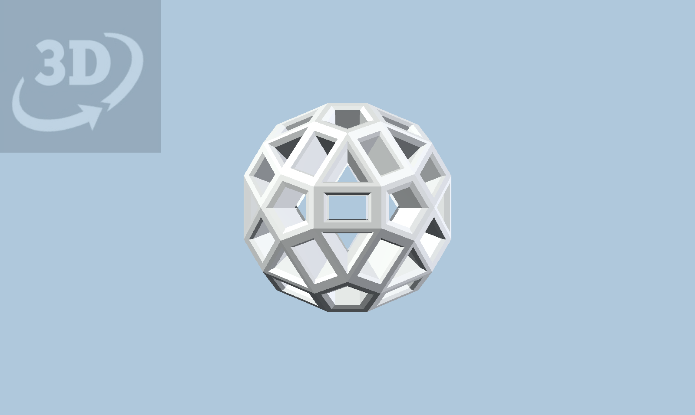

<section class="zometool-intro">
  

    <vzome-viewer-previous label="上一步" load-camera="true" viewer="welcome" class="hidden">
    </vzome-viewer-previous>

    <vzome-viewer-next label="下一步" load-camera="true" viewer="welcome" class="hidden">
    </vzome-viewer-next>

    <h1 id="title"></h1>
  

  <textarea id="description" readonly></textarea>

  <vzome-viewer id="welcome" indexed="true" src="Zometool-intro-zh.vZome">
    
  </vzome-viewer>
</section>

  这是 Scott Vorthmann 的 <a href="https://www.vzome.com/docs/zometool-intro.html">Introduction to Zometool</a>
  的中文翻译版本。原始 vZome 模型和英文说明由 Scott Vorthmann 创建；中文翻译由马楠整理。

