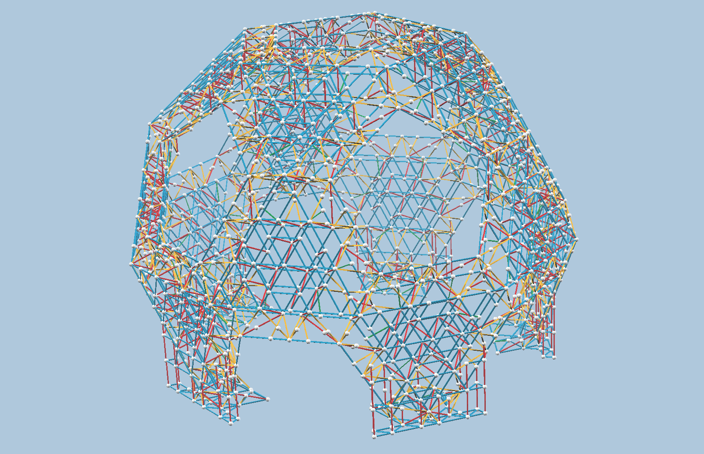
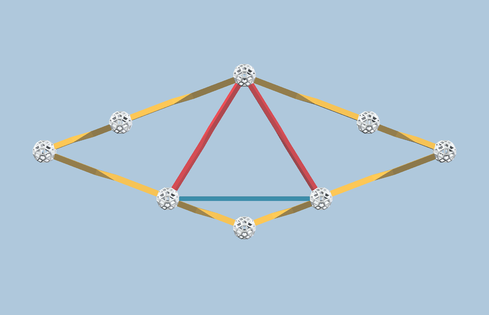
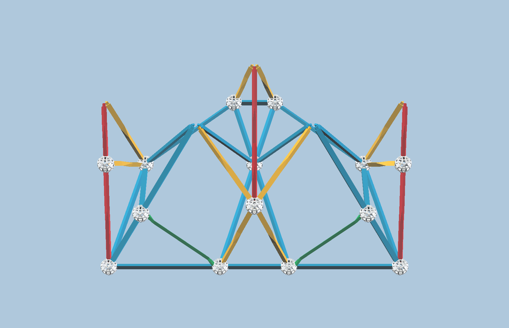
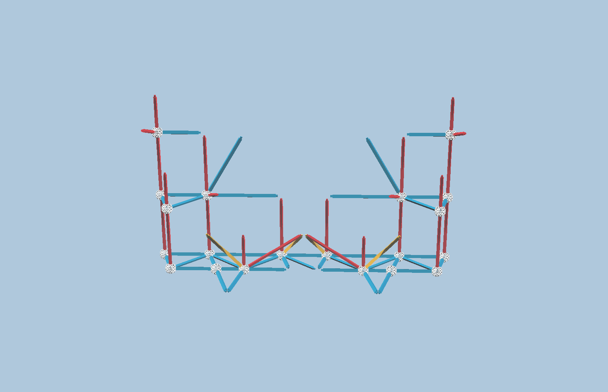
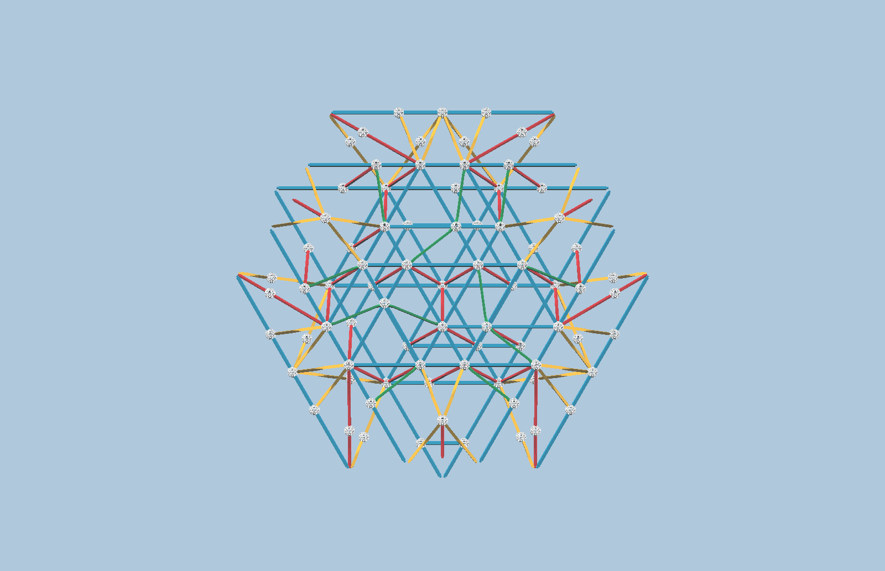
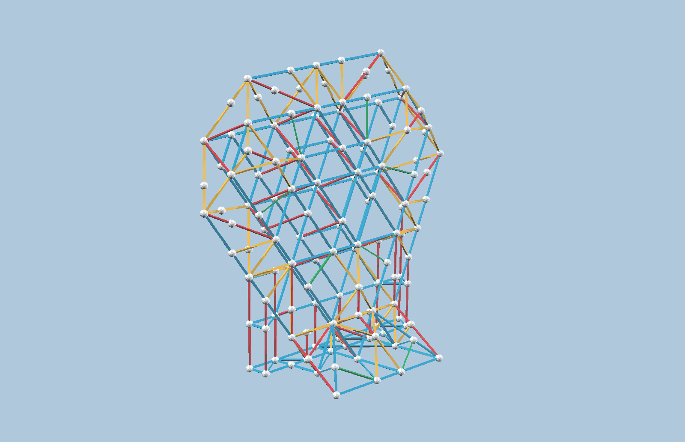
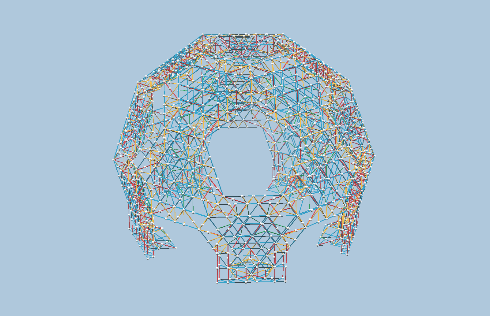


中文版本基于 Scott Vorthmann 的 SUMaC 2026 Zome Build 页面：
https://vorth.github.io/vzome-sharing/2026/07/02/SUMaC-2026-Zometool-Build-13-52-17-489Z.html


  今天我们要搭建一个大型 Zometool 模型：一个截半二十面体形状的穹顶。模型直径接近两米。

  本中文说明基于 Scott Vorthmann 为 SUMaC 2026 活动创建的英文搭建说明和 vZome 模型。
  原始英文页面在
  <a href="https://vorth.github.io/vzome-sharing/2026/07/02/SUMaC-2026-Zometool-Build-13-52-17-489Z.html">这里</a>；
  中文翻译和活动说明由马楠整理。

  如果你第一次接触 Zometool，可以先看
  <a href="/vzome-sharing/2026/07/08/zometool-intro-zh/">Zometool 入门中文说明</a>。

  下面先看整个结构的概览。后面的各个模块可以打开“显示搭建步骤”开关；
  这些步骤主要是用来说明结构和拼搭过程，不一定是严格的逐步搭建顺序。

<figure class="model-viewer">
  <vzome-viewer src="assembled.vZome">
    
  </vzome-viewer>

  <figcaption style="text-align: center; font-style: italic;">
    我们要搭建的整体模型
  </figcaption>
</figure>

本次搭建需要准备以下模块：

<ul>
  <li>25 个连接件</li>
  <li>5 个底脚</li>
  <li>5 个加固件</li>
  <li>15 个面模块</li>
</ul>

  各个模块准备好之后，我们会从地面开始，逐层向上组装整个穹顶。

  
<strong>总零件清单（25 个连接件，5 个底脚，5 个加固件，15 个面模块）</strong>

  <table>
    <tbody>
      <tr><td class="part-blue">B0</td><td class="part-blue">55</td><td class="part-blue">B1</td><td class="part-blue">965</td><td class="part-blue">B2</td><td class="part-blue">890</td></tr>
      <tr><td class="part-red">R0</td><td class="part-red">20</td><td class="part-red">R1</td><td class="part-red">180</td><td class="part-red">R2</td><td class="part-red">630</td></tr>
      <tr><td class="part-yellow">Y0</td><td class="part-yellow">0</td><td class="part-yellow">Y1</td><td class="part-yellow">310</td><td class="part-yellow">Y2</td><td class="part-yellow">680</td></tr>
      <tr><td class="part-green">G1</td><td class="part-green">190</td><td></td><td></td><td>球</td><td>1555</td></tr>
    </tbody>
  </table>

<h2>拼搭模块</h2>

<h3>连接件</h3>

我们需要 <strong><em>25</em></strong> 个这样的连接件：

<figure class="model-viewer">
  <zometool-instructions module="junction"
        src="joint_module_steps.vZome">
    
  </zometool-instructions>

  <figcaption style="text-align: center; font-style: italic;">
    连接件（共 25 个）
  </figcaption>
</figure>

  
<strong>起步定标：</strong>先用 1 根 B2 和 2 根 R2 搭起始三角形；之后按 3D 图继续。

  
<strong>单个连接件零件清单</strong>

  <table>
    <tbody>
      <tr><td class="part-blue">B0</td><td class="part-blue"></td><td class="part-blue">B1</td><td class="part-blue"></td><td class="part-blue">B2</td><td class="part-blue">1</td></tr>
      <tr><td class="part-red">R0</td><td class="part-red"></td><td class="part-red">R1</td><td class="part-red"></td><td class="part-red">R2</td><td class="part-red">2</td></tr>
      <tr><td class="part-yellow">Y0</td><td class="part-yellow"></td><td class="part-yellow">Y1</td><td class="part-yellow">4</td><td class="part-yellow">Y2</td><td class="part-yellow">4</td></tr>
      <tr><td class="part-green">G1</td><td class="part-green"></td><td></td><td></td><td>球</td><td>8</td></tr>
    </tbody>
  </table>

<h3>底脚</h3>

  我们还需要 <strong><em>5</em></strong> 个底脚。
  注意：底脚模型里有些棍的一端没有球，因为这些球会由连接件提供。

<figure class="model-viewer">
  <zometool-instructions module="foot"
        src="foot_module_steps.vZome">
    
  </zometool-instructions>

  <figcaption style="text-align: center; font-style: italic;">
    底脚（共 5 个）
  </figcaption>
</figure>

  
<strong>起步定标：</strong>先用 1 根 B1 和 2 根 B2 搭起始三角形；之后按 3D 图继续。

  
<strong>单个底脚零件清单</strong>

  <table>
    <tbody>
      <tr><td class="part-blue">B0</td><td class="part-blue">1</td><td class="part-blue">B1</td><td class="part-blue">7</td><td class="part-blue">B2</td><td class="part-blue">14</td></tr>
      <tr><td class="part-red">R0</td><td class="part-red"></td><td class="part-red">R1</td><td class="part-red">3</td><td class="part-red">R2</td><td class="part-red">3</td></tr>
      <tr><td class="part-yellow">Y0</td><td class="part-yellow"></td><td class="part-yellow">Y1</td><td class="part-yellow">4</td><td class="part-yellow">Y2</td><td class="part-yellow">6</td></tr>
      <tr><td class="part-green">G1</td><td class="part-green">2</td><td></td><td></td><td>球</td><td>14</td></tr>
    </tbody>
  </table>

<h3>加固件</h3>

  我们还需要 <strong><em>5</em></strong> 个加固件来帮助底脚支撑整个结构。
  注意：这里也有些棍的一端没有球；最后组装时，这些球会由连接件和面模块提供。

<figure class="model-viewer">
  <zometool-instructions module="foothold"
        src="foothold_steps.vZome">
    
  </zometool-instructions>

  <figcaption style="text-align: center; font-style: italic;">
    加固件（共 5 个）
  </figcaption>
</figure>

  
<strong>起步定标：</strong>先用 2 根 B0 和 2 根 B1 搭起始梯形；之后按 3D 图继续。

  
<strong>单个加固件零件清单</strong>

  <table>
    <tbody>
      <tr><td class="part-blue">B0</td><td class="part-blue">10</td><td class="part-blue">B1</td><td class="part-blue">24</td><td class="part-blue">B2</td><td class="part-blue">6</td></tr>
      <tr><td class="part-red">R0</td><td class="part-red">4</td><td class="part-red">R1</td><td class="part-red">6</td><td class="part-red">R2</td><td class="part-red">14</td></tr>
      <tr><td class="part-yellow">Y0</td><td class="part-yellow"></td><td class="part-yellow">Y1</td><td class="part-yellow">2</td><td class="part-yellow">Y2</td><td class="part-yellow">2</td></tr>
      <tr><td class="part-green">G1</td><td class="part-green"></td><td></td><td></td><td>球</td><td>20</td></tr>
    </tbody>
  </table>

<h3>面模块</h3>

  我们总共需要 <strong><em>15</em></strong> 个面模块。
  注意：这里也有些棍的一端没有球；最后组装时，这些球会由连接件提供。

<figure class="model-viewer">
  <zometool-instructions module="face unit"
        src="face_module_steps.vZome">
    
  </zometool-instructions>

  <figcaption style="text-align: center; font-style: italic;">
    面模块（共 15 个）
  </figcaption>
</figure>

  
<strong>起步定标：</strong>先用 12 根 B2 搭起始六边形；之后按 3D 图继续。

  
<strong>单个面模块零件清单</strong>

  <table>
    <tbody>
      <tr><td class="part-blue">B0</td><td class="part-blue"></td><td class="part-blue">B1</td><td class="part-blue">54</td><td class="part-blue">B2</td><td class="part-blue">51</td></tr>
      <tr><td class="part-red">R0</td><td class="part-red"></td><td class="part-red">R1</td><td class="part-red">9</td><td class="part-red">R2</td><td class="part-red">33</td></tr>
      <tr><td class="part-yellow">Y0</td><td class="part-yellow"></td><td class="part-yellow">Y1</td><td class="part-yellow">12</td><td class="part-yellow">Y2</td><td class="part-yellow">36</td></tr>
      <tr><td class="part-green">G1</td><td class="part-green">12</td><td></td><td></td><td>球</td><td>79</td></tr>
    </tbody>
  </table>

<h2>组装模块</h2>

<h3>组装腿</h3>

  我们需要用之前的模块组装 <strong><em>5</em></strong> 条腿来支撑上方的结构。
  每条腿需要：1 个底脚，1 个加固件，1 个面模块，3 个连接件。
  按 3D 图组装

<figure class="model-viewer">
  <zometool-instructions module="leg assembly"
        src="assembled_leg_complex.vZome">
    
  </zometool-instructions>

  <figcaption style="text-align: center; font-style: italic;">
    组装腿（共 5 个）
  </figcaption>
</figure>

<h3>最终组装</h3>

  最终组装时，先把 5 条腿围成一圈放在地上，底脚朝里，加固件朝外，注意间距不要太远。然后逐层往上搭建。

<figure class="model-viewer">
  <zometool-instructions module="assembly"
        src="final_assembled_steps.vZome">
    
  </zometool-instructions>

  <figcaption style="text-align: center; font-style: italic;">
    最终组装
  </figcaption>
</figure>

<h2>资源</h2>

<ul>
  <li><a href="/vzome-sharing/2026/07/08/zometool-intro-zh/">Zometool 入门中文说明</a></li>
  <li><a href="https://www.zometool.com.cn">Zometool 中国</a></li>
  <li><a href="https://www.zometool.com">Zometool 美国、欧洲、日本和韩国</a></li>
  <li><a href="https://www.vzome.com/app">vZome 软件（免费）</a>：用于设计结构并生成这个网页</li>
  <li><a href="https://vorth.github.io/vzome-sharing/2026/07/02/SUMaC-2026-Zometool-Build-13-52-17-489Z.html">Scott Vorthmann 的英文原版说明</a></li>
</ul>
