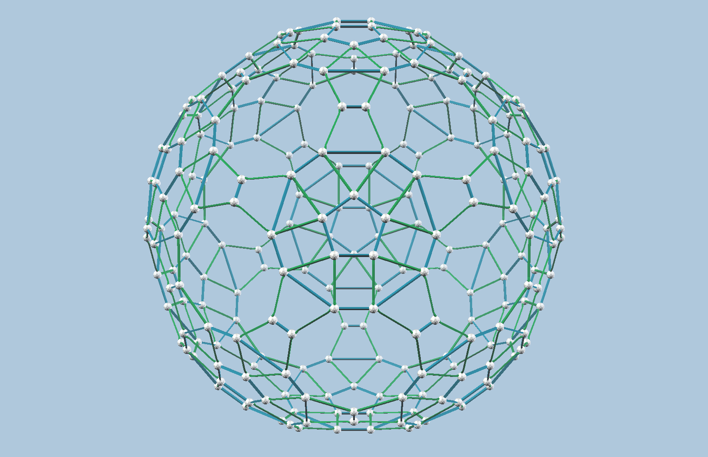
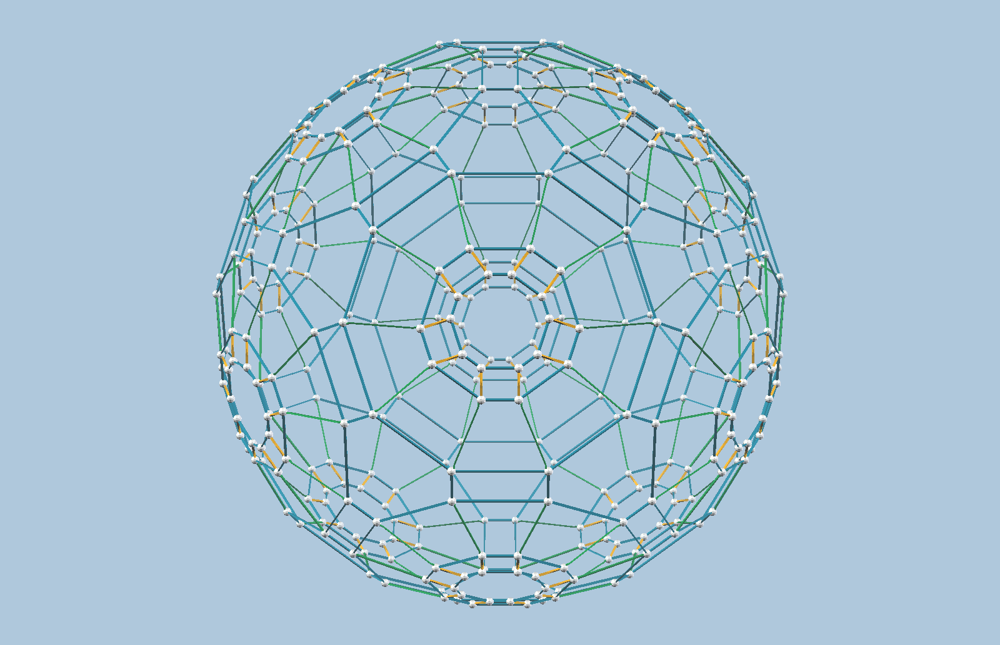
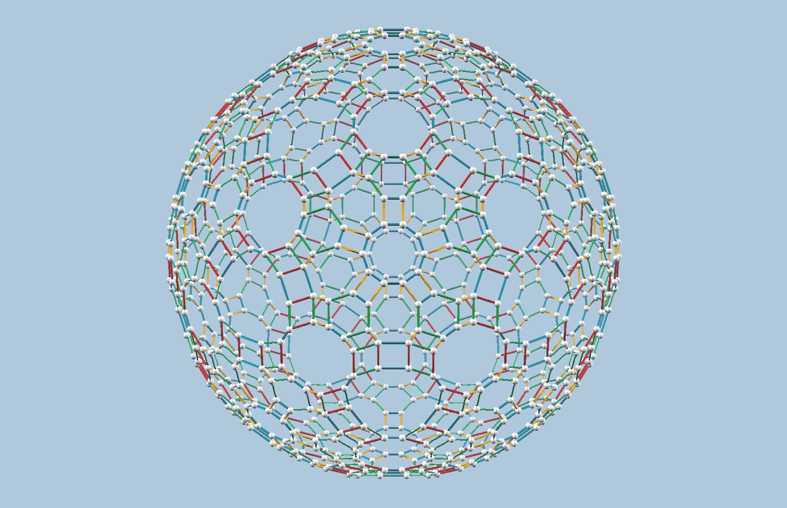
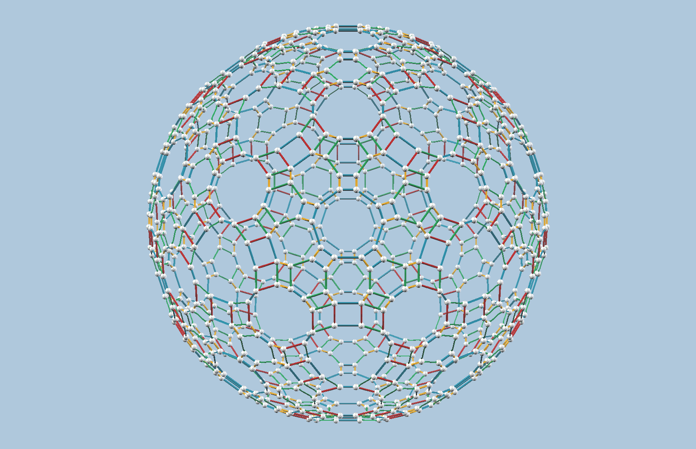

Each model is a hollow Zometool shell: every ball sits on one thin spherical
shell centred on the origin, and every edge of the convex hull is a **single**
standard strut (RGBY, scales 0-3, no concatenation). There is no ball at the
centre, and face diagonals are not struts.

Drag to rotate any model. The still image is replaced by the interactive
version once it finishes loading.

<figure class="approx-model">
 <vzome-viewer src="ball_240_a.vZome" progress="true" >
  
 </vzome-viewer>
 <figcaption>
  240 balls (variant a) 420 struts
  Every ball lies on one sphere.
 </figcaption>
</figure>

<figure class="approx-model">
 <vzome-viewer src="ball_240_b.vZome" progress="true" >
  
 </vzome-viewer>
 <figcaption>
  240 balls (variant b) 420 struts
  Every ball lies on one sphere.
 </figcaption>
</figure>

<figure class="approx-model">
 <vzome-viewer src="ball_240_c.vZome" progress="true" >
  
 </vzome-viewer>
 <figcaption>
  240 balls (variant c) 450 struts
  Every ball lies on one sphere.
 </figcaption>
</figure>

<figure class="approx-model">
 <vzome-viewer src="ball_360.vZome" progress="true" >
  
 </vzome-viewer>
 <figcaption>
  360 balls 660 struts
  Ratios between radii &asymp; 99.96%
 </figcaption>
</figure>

<figure class="approx-model">
 <vzome-viewer src="ball_960_b.vZome" progress="true" >
  
 </vzome-viewer>
 <figcaption>
  960 balls (variant b) 1500 struts
  Ratios between radii &asymp; 99.48%
 </figcaption>
</figure>

<figure class="approx-model">
 <vzome-viewer src="ball_960_a.vZome" progress="true" >
  
 </vzome-viewer>
 <figcaption>
  960 balls (variant a) 1500 struts
  Ratios between radii &asymp; 99.48%
 </figcaption>
</figure>
