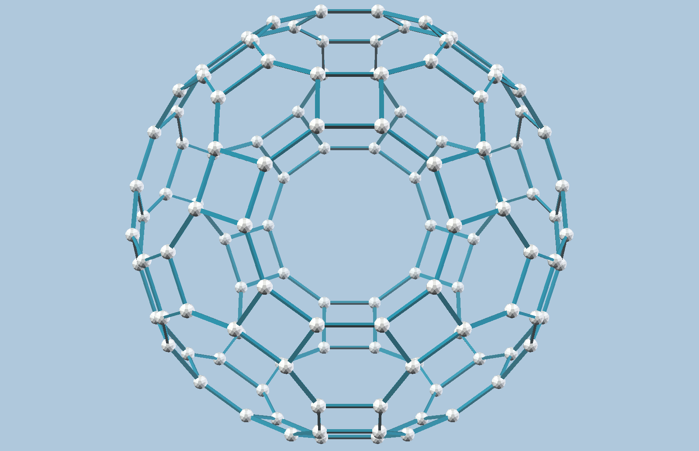
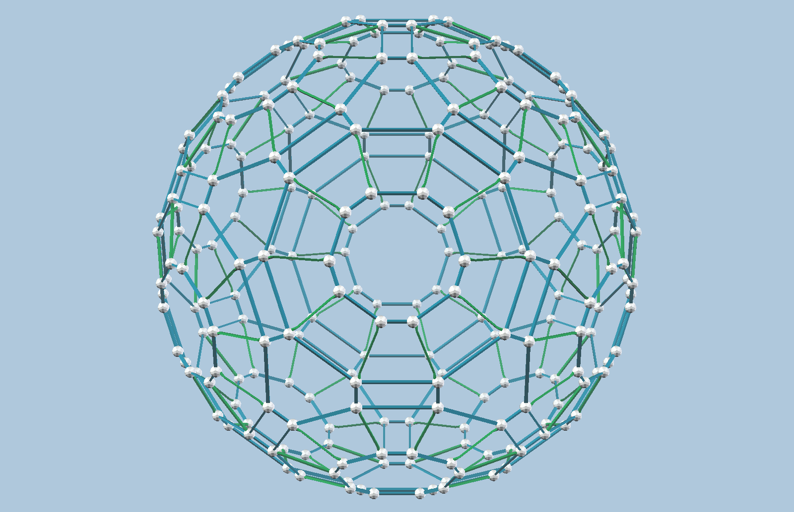
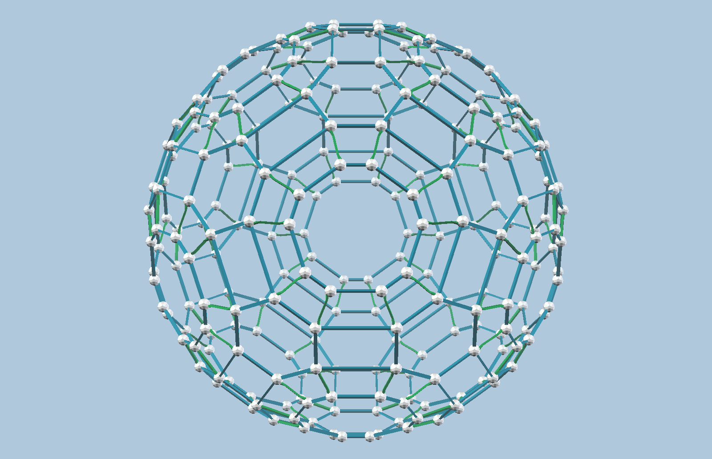
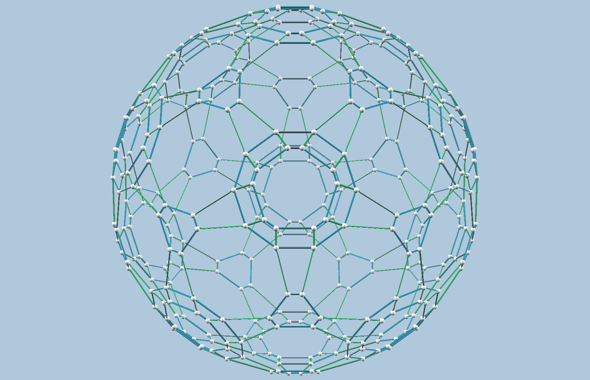
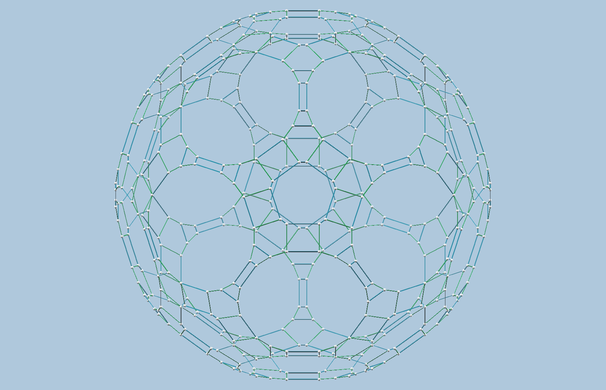

Every model here is **perfectly round**: all of its balls sit at exactly the
same distance from the centre &mdash; equal in exact arithmetic, not merely
to within a tolerance &mdash; so they lie on a common sphere. Every edge of
the convex hull is a **single** standard strut. Drag to rotate any model.
For shells that are very round but not exactly so, see
[Approximate Zome Spheres](../../../07/26/approximate-zome-spheres/).

<figure class="approx-model">
 <vzome-viewer src="truncated_icosidodecahedron.vZome" progress="true" tween-duration="0" >
  
 </vzome-viewer>
 <figcaption>
  Truncated icosidodecahedron &mdash; 120 balls 180 struts
  An Archimedean solid. All 120 balls lie in one orbit, so a common radius comes free from the symmetry.
 </figcaption>
</figure>

<figure class="approx-model">
 <vzome-viewer src="ball_240_a.vZome" progress="true" tween-duration="0" >
  
 </vzome-viewer>
 <figcaption>
  240 balls (variant a) 420 struts
  Two orbits at a common radius.
 </figcaption>
</figure>

<figure class="approx-model">
 <vzome-viewer src="ball_240_b.vZome" progress="true" tween-duration="0" >
  
 </vzome-viewer>
 <figcaption>
  240 balls (variant b) 420 struts
  Two orbits at a common radius.
 </figcaption>
</figure>

<figure class="approx-model">
 <vzome-viewer src="ball_240_c.vZome" progress="true" tween-duration="0" >
  
 </vzome-viewer>
 <figcaption>
  240 balls (variant c) 450 struts
  Three orbits at a common radius.
 </figcaption>
</figure>

<figure class="approx-model">
 <vzome-viewer src="exact_360.vZome" progress="true" tween-duration="0" >
  
 </vzome-viewer>
 <figcaption>
  360 balls 600 struts
  Three orbits. Most balls with full icosahedral symmetry, struts of length 0-2.
 </figcaption>
</figure>

<figure class="approx-model">
 <vzome-viewer src="exact_480_span3.vZome" progress="true" tween-duration="0" >
  
 </vzome-viewer>
 <figcaption>
  480 balls 720 struts
  Four orbits. Most balls with full icosahedral symmetry, struts of length 0-3.
 </figcaption>
</figure>
